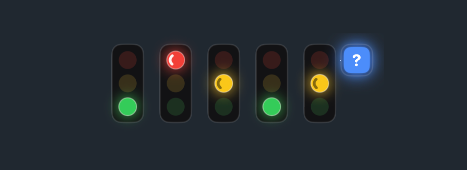

# claude-traffic-light 🚦

A tiny always-on-top **traffic light** for macOS that shows what [Claude Code](https://claude.com/claude-code) is doing right now — driven by Claude Code hooks. One light per session, so you can watch several terminals at once.



- 🟢 **green** — idle, agent finished and is waiting for you
- 🟡 **yellow** — thinking / preparing / generating a reply (spinner animates)
- 🔴 **red** — running a tool (spinner animates), or waiting for your answer to a question (steady, no spinner)
- ❓ **question block** — Claude is waiting on you: a permission prompt, an `AskUserQuestion`, or a plain text question

Each session gets its own light in a row. When a light shows the question block, its neighbours reflow so nothing overlaps. Lights can be switched between three shapes — vertical, horizontal, and triangular (🟡 top / 🟢 left / 🔴 right) — via the right-click menu.

## How it works

```
Claude Code (session N)
   └─ hook (bash + curl) ──JSON{session_id,event,cwd}──▶  claude-traffic-light.app
                                                            ├─ HTTP server on 127.0.0.1:47615
                                                            ├─ one light per session_id
                                                            └─ floating SwiftUI overlay
```

Claude Code fires lifecycle hooks; a small shell gateway forwards each event (with the session's `session_id` and `cwd`) to a local HTTP server inside the app, which updates the matching light.

| Hook event        | Meaning                        | Result        |
|-------------------|--------------------------------|---------------|
| `UserPromptSubmit`| prompt sent, agent starts      | 🟡 yellow      |
| `PreToolUse`      | tool starts                    | 🔴 red         |
| `PostToolUse`     | tool finished (thinking again) | 🟡 yellow, clears ❓ |
| `Notification`    | permission / waiting (only while the agent is active) | ❓ question |
| `Stop`            | agent finished                 | 🟢 green — or 🔴 + ❓ if it ended with a text question |
| `SessionStart` / `SessionEnd` | session appears / closes | add / remove light |

See [`docs/hooks.md`](docs/hooks.md) for the full mapping, including how a text question at the end of a turn is detected (via the transcript) and turned into a 🔴 + ❓ light.

## Interaction

- **Hover** — cursor turns into a hand, the light brightens, and a tooltip (pinned above the light) shows `folder · branch`.
- **Click** — bring the session's window to the front. The owner app (from the hook's `__CFBundleIdentifier`) is activated, and for multi-window IDEs the window whose title contains the project folder name is raised (`activate` + `AXRaise` Apple Event). Needs Automation + Accessibility permission, prompted on first click (see [`scripts/`](scripts/README.md) for the standalone equivalent).
- **Double-click** — cycle scale +10% up to +50%, then reset. Scale and window position are remembered.
- **Drag** — move the window anywhere; position is saved.
- **Right-click** — context menu: **Сменить вид** (cycle vertical → horizontal → triangular), **Показать/Скрыть названия** (folder name under/beside each light, truncated to its length), or **Quit**. All remembered.

## Build & install

Requires macOS 13+ and a Swift toolchain (Xcode / Swift 5.9+).

```bash
# 1. Build the release .app into ~/Applications
./build-app.sh

# 2. Install autostart (LaunchAgent, runs at login)
./install-autostart.sh
```

To stop / remove autostart:

```bash
launchctl bootout gui/$(id -u)/com.alex.claude-traffic-light
```

Or just **right-click → Quit** (with `KeepAlive=false` the app stays quit until next login or manual relaunch).

Development build & run:

```bash
swift run
```

## Wire up the hooks

A ready-to-paste hooks block lives in [`hooks/settings.example.json`](hooks/settings.example.json). Merge its `"hooks"` object into `~/.claude/settings.json` and replace the placeholder path with your clone location:

```bash
# Print the block with your absolute path already filled in, then copy it into settings.json:
sed "s#/ABSOLUTE/PATH/TO/claude-traffic-light#$(pwd)#g" hooks/settings.example.json

# Make the scripts executable (once):
chmod +x hooks/traffic-hook.sh hooks/last-question.py
```

Restart Claude Code (or start a new session) to reload `settings.json`. The gateway pipes each hook's stdin JSON to `http://127.0.0.1:47615` and fails silently when the app isn't running, so it never blocks Claude Code.

**Step-by-step, event mapping, and the text-question detection are documented in [`docs/hooks.md`](docs/hooks.md).**

## Layout

- `Sources/TrafficLight/` — Swift sources (App, Model, Overlay, Server, Tooltip, Design, Git, OverlayWindow)
- `hooks/traffic-hook.sh` — hook → HTTP gateway
- `hooks/last-question.py` — `Stop` transcript check (text question → 🔴 + ❓)
- `hooks/settings.example.json` — ready-to-paste hooks block for `~/.claude/settings.json`
- `docs/hooks.md` — full hooks setup & event mapping
- `scripts/` — standalone reference scripts (e.g. focus a project window)
- `build-app.sh` — build the release `.app` bundle into `~/Applications`
- `install-autostart.sh` — install the LaunchAgent
- `com.alex.claude-traffic-light.plist` — LaunchAgent template

## Notes

- The overlay window never takes focus (no focus ring), floats above everything, and joins all Spaces including fullscreen apps.
- There is no distinct "typing a reply" event in Claude Code, so yellow covers both thinking and generating text; red is precise (only while a tool runs).
- The `Notification` hook can fire with a small delay — that's Claude Code's timing, not the app's.
